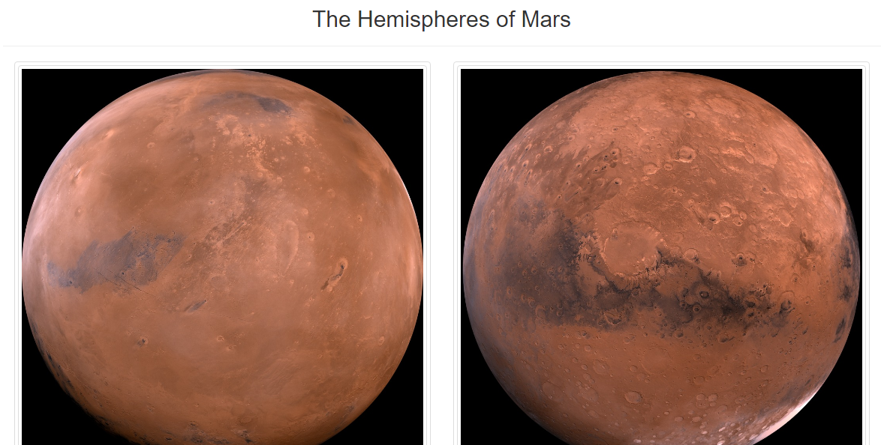
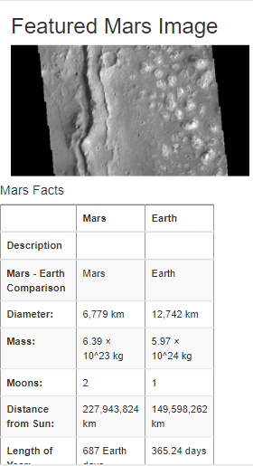

# Mission_to_Mars

## Project Overview
The purpose of this analysis is to provide a web application that will scrape new data on news revolving around the planet Mars, every time a user tells it to - with the click of a button. 

## Resources
- Data sources: https://data-class-mars.s3.amazonaws.com/Mars/index.html, https://data-class-jpl-space.s3.amazonaws.com/JPL_Space/index.html, https://marshemispheres.com/
- Software: Jupyter Notebook: 6.3.0, Visual Studio Code 1.60.2, MongoDB 5.0, Flask 2.0.2

## Results
Provided the link to my web application, any user should be able to find the most recent news regarding the red planet next door. My website scrapes data from other news sources on Mars, and provides information about the planet in a table. Next to a Mars column is an Earth column, with information about both printed next to one another for a quick comparison. 

Additionally, I have included images from NASA websites and various other webistes of images taken in outer space. 

Finally, not only is this web application visible and usable on desktop, but it is tailored for mobile devices, as well. The image below is a screenshot from a mobile phone's point of view.

